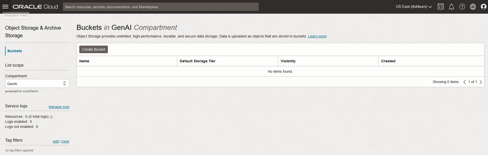
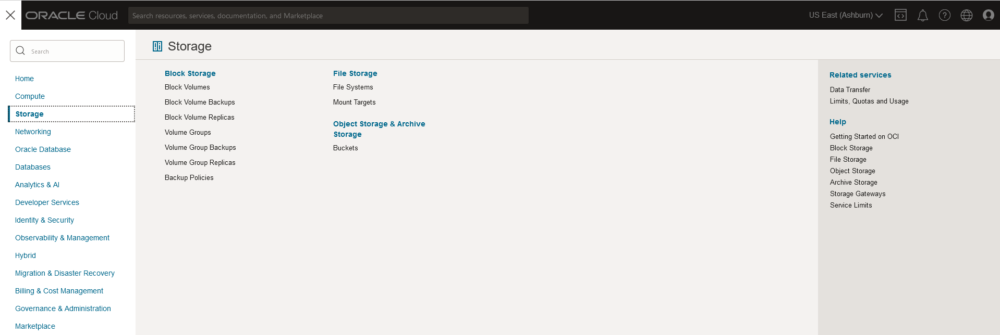
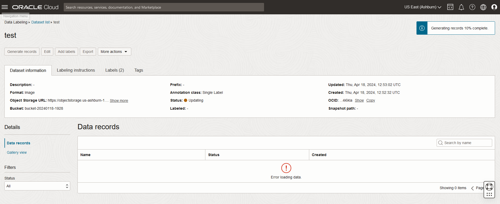
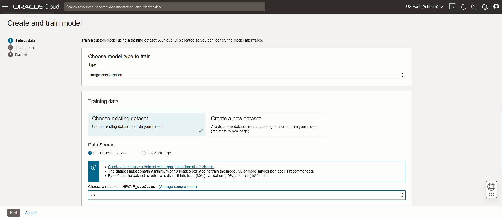
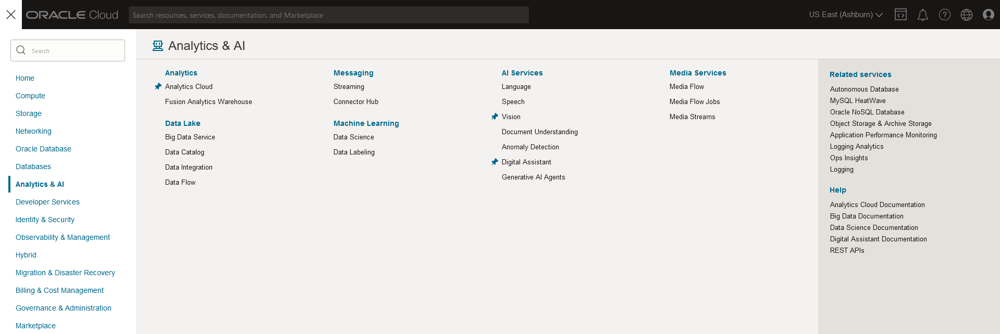
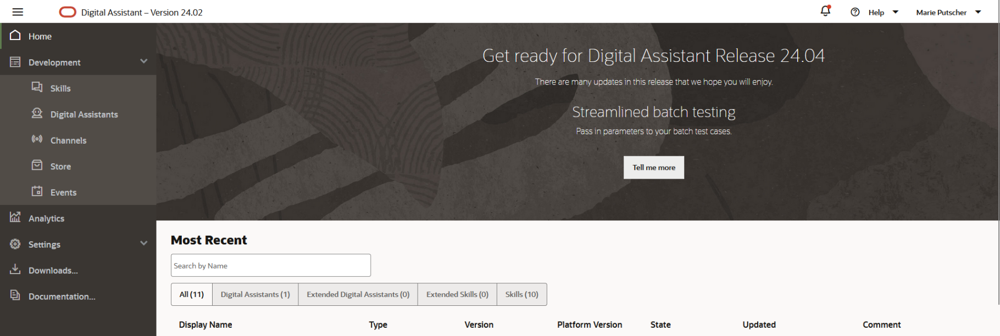
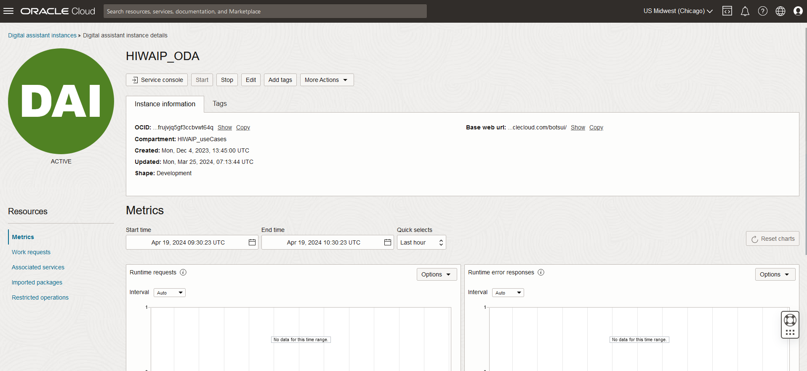
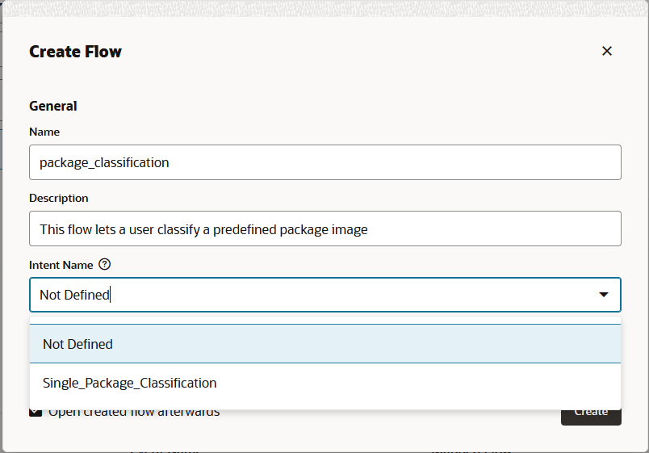
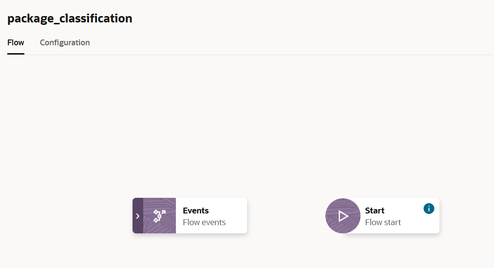
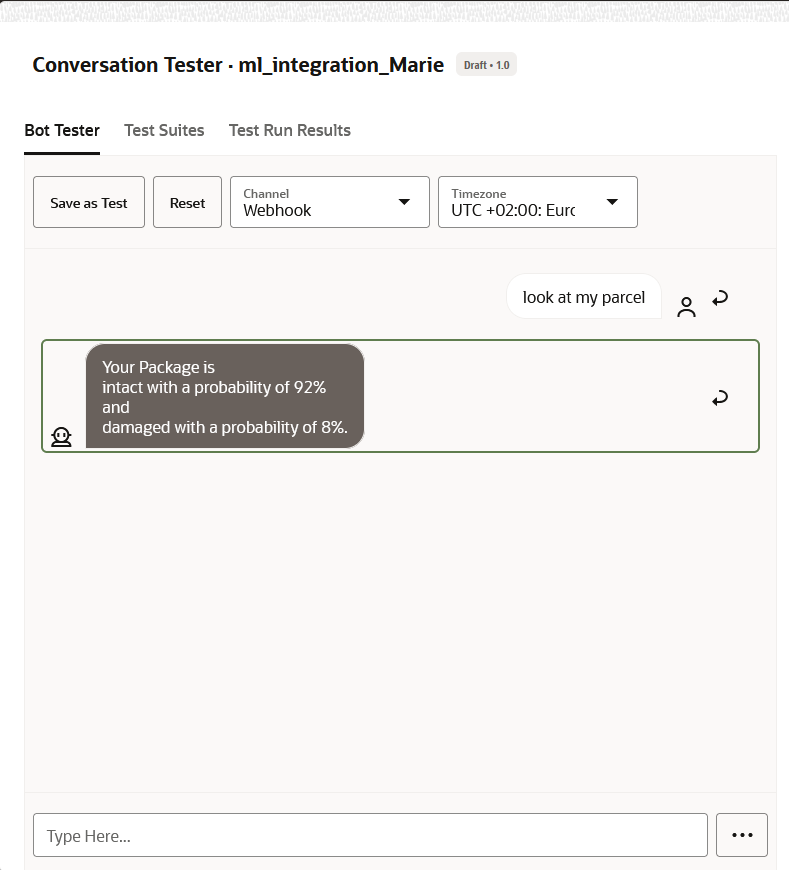

# Automate Image Classification with Oracle Digital Assistant and OCI Generative AI

## Prerequisites

To start you need

- A Cloud Tenancy. Don’t have one? [Create one here](https://signup.cloud.oracle.com/)
- A compartment to work in. [Read here](https://docs.oracle.com/en-us/iaas/Content/Identity/Tasks/managingcompartments.htm)
- A VCN to work in. [Read here](https://docs.oracle.com/en-us/iaas/Content/Network/Concepts/overview.htm)
- A Dataset (training and testing set) for training and verifying your Vision model. [Download the dataset here](https://www.kaggle.com/datasets/rahulm7323/damaged-and-intact-packages)
    
    Notice that the damaged and intact images are in two folders. Download
    both and add roughly 2/3 of the damaged and 2/3 of the intact pictures
    together in one folder for Training and the rest in another one for
    Testing.

# Contents

1. [Prerequisites](#prerequisites)
1. [Vision Service](#vision-service)
    1. [Bucket in Object Storage](#bucket-in-object-storage)
    1. [Data Labeling](#data-labeling)
    1. [Vision Model Creation](#vision-model-creation)
1. [Oracle Digital Assistant (ODA)](#oracle-digital-assistant-oda)
    1. [Set up of a Digital Assistant](#set-up-of-a-digital-assistant)
    1. [Skill Creation](#skill-creation)
    1. [API Service Creation](#api-service-creation)
    1. [Dialogue Flow Creation](#dialogue-flow-creation)

## Vision Service

### Bucket in Object Storage

- In the OCI open the Burger Menu and go to **Storage > Object Storage & Archive Storage > Buckets**

    
  
    

- Click **Create Bucket** and make sure you are in the right compartment.
  Give your Bucket a meaningful name and leave the configuration as
  default. Click **Create.**

- Wait until your Bucket is provisioned.

- Click on your newly-provisioned bucket and create a folder
  `Training_Set`. Upload all pictures you want to use to train your
  Vision model into this folder.

- Create a second folder called `Test_Set` and upload all your images
  for testing.

### Data Labeling

- Open the Burger Menu and go to **Analytics & AI > Machine Learning >
  Data Labeling**

- Click on Datasets in the left Menu Pane and click **Create Dataset**

- Enter a meaningful name, select *Images as Dataset format, and
  choose *Single Label* as Annotation class. Optionally add a
  description and a Labeling instruction.

- Click Next.

- Select **Select from Object Storage**
    - Ensure that the right Compartment is selected
    - Choose the Bucket you just created in the drop-down list
    - Write `Training_Set` in the Prefix --- this will ensure only the data from
    your created folder in the Bucket is selected.

- The Selected Files will be displayed. Review them.

- In Add labels, add the Labels you want to use to label the pictures
  with. In our case, we will add `damaged` and `intact`. Enter a
  word and hit enter, then enter the next one.

- Click **Next**.

- Review and click **Create**.

- Your Dataset Page opens, and the records are being created. This might take
  a couple of minutes.

    

- If you need to get to the Dataset later again, you need to go to
  **Data Labeling > Datasets** (in the left menu) and click on your
  respective dataset.

- When your dataset is fully provisioned, open it and start labeling
  your images as described [here](https://docs.oracle.com/en-us/iaas/Content/data-labeling/using/label-image-add-multiple.htm#label-image-add-multiple).

You should now have a fully labeled training data set.

### Vision Model Creation

- Open the Burger Menu and go to **Analytics&AI > AI Services > Vision**.

- In the left menu under Custom Models click on **Projects**.

- Click on **Create Project**, choose the right compartment, and give it a
  meaningful name and optionally a description. Click **Create Project.**

- Wait until you new Project is active. This just takes a couple of
  seconds.

- Click on your newly created Project.

- Now Click on **Create Model** and choose the following:

    - **Type:** Image classification

    - **Training data:** Choose existing dataset

    - **Data Source:** Data Labeling Service

    - **Choose a dataset…:** Make sure you are in the right compartment
      and choose the data set you created in Data Labeling.

    - Click **Next.**

- Enter a meaningful *Model display name. Optionally enter a Model
  description.

- For **Training duration:** if you have the time, choose *Recommended
  mode*. If you want a faster, but less accurate result, choose *Quick
  Mode*.

- Click **Next.**

- Review the information and click **Create and train.**

    

- Wait until your model is fully trained.

- Open your model and review the model details. You can upload an image
  from your local storage to test your model. Your model is now ready to
  use. Here, you will also find the model's *OCID*, this id will be important
  when you want to make an API call to you model as we do in [API Service Creation](#api-service-creation).

## Oracle Digital Assistant (ODA)

### Set up of a Digital Assistant

- In the OCI open the Burger Menu and go to **Analytics&AI > AI Services > Digital Assistant**.

    

- Click on **Create digital assistant instance.** Enter the following:

    - **Compartment:** Make sure the correct compartment is selected.

    - **Name:** Choose a meaningful name.

    - **Description:** Optionally enter an informative description.

    - **Shape:** Choose *Development.*

    - Click **Create.**

- The provisioning will take some time. When your Instance is active,
  click on it. This is your instance information page.

- Click on **Service Console** to open the user interface you use to design your digital assistant.

- Get familiar with the interface. For further information on the
  digital assistant [see here](https://docs.oracle.com/en/cloud/paas/digital-assistant/).

    

    

- For your Digital Assistant Instance to interact with other resources
  in your tenancy, we need to give it the right permissions. See
  [here](https://docs.oracle.com/en-us/iaas/digital-assistant/doc/users-groups-and-policies1.html)
  for further information.

### Skill Creation

- In the UI click on the Burger Menu and select **Development > Skills**

- Click on **+ New Skill** and enter the following:

    - **Display Name:** enter a meaningful name

    - **Name:** enter a meaningful name

    - Enter a one-sentence description

    - Leave the rest leave as default.

    - Click **Create**. Your newly created Skill opens.

- Click on **+ Intent.** Enter the following information:

    - **Conversation Name:** Package Classification

    - **Name:** Package Classification

    - **Description:** optional

    - **Utterances to Add:**
        - classify my package
        - look at my parcel
        - what does my parcel look like
        - how's my package?
        - is my package damaged?
        - is my package fine?
        - is my package okay?

- Create a second dummy intent. We need at least two intents in a skill
  for it to work.

- Click on **+ Add Intent.** Enter the following information:

  - **Conversation Name:** dummy
  - **Name:** dummy
  - **Description:** This is just a dummy Intent since we need at least
    two to train a Skill.
  - **Utterances to Add:**
      - Dummy utterance

- Click on **Train** on the upper right corner. Choose **Trainer Ht**
  and click **Submit.**

### API Service Creation

To keep it simple, we will show an easy API call to the Vision Service.
This can later then be extended to more complicated cases.

- In the Digital Assistant User Interface open the Burger Menu and go to
  **Settings > API Services**.

- Click **+ Add Rest Service**.

- Enter the following information:

  - **Name:** VISION_CLASSIFICATION
  - **Endpoint:** *[your tenancy’s Vision service endpoint [found here](https://docs.public.oneportal.content.oci.oraclecloud.com/en-us/iaas/api/#/en/vision/20220125/)]*/20220125/actions/analyzeImage

  - **Description:** a meaningful description

  - **Method:** POST

  - Click **Create**. The newly created API Service opens.

- Add the following information:

  - **Authentication Type:** Resource Principals (make sure you have the
    right policies set in your tenancy, for further information [see here](https://docs.oracle.com/en-us/iaas/digital-assistant/doc/users-groups-and-policies1.html).)

  - **Body:**

      ```json
      {
        "compartmentId": "<your compartment OCID>",
        "features": [
          {
            "modelId": "<your model OCID>",
            "featureType": "IMAGE_CLASSIFICATION",
            "maxResults": 5
          }
        ],
        "image": {
          "source": "OBJECT_STORAGE",
          "bucketName": "<name of you bucket created in Setup of a Digital Assistant>",
          "namespaceName": "<namespace of your bucket, can be found on the bucket information page in the OCI>",
          "objectName": "Test_Set/<name of one item in your test dataset>"
        }
      }
      ```

- Click on **Test Request** to verify your API call works. Review the
  response payload, received from the Speech service.

### Dialogue Flow Creation

- Go to the Skill created in [Skill Creation](#skill-creation).

- On the left menu click on **Flows**.

- Click on **+ Add Flow** and enter the following information:

    - **Name:** package_classification

    - **Description:** This flow lets a user classify a predefined package image

    - **Intent Name:** From the drop-down menu choose *Package Classification* the intent created in [Skill Creation](#skill-creation)

    - Click **Create**

        

    - The newly created flow opens.

        

    - Hover over the Start tile and click on the three dots. Click **Add start state**.

    - In the window that opens, in the left menu scroll down to **Service
      Integration**. Click on it and choose **Call REST Service.**

    - Change the name to `call_PackageClassification_RestService`.

    - Click **Insert**.

- In the menu that opens on the right, from the drop-down list for
  **Rest Service** choose **VISION_CLASSIFICATION**, the API Service
  created in [API Service Creation](#api-service-creation).

    - Now, from the drop-down list for **Method**, choose *POST*.

    - Leave the rest as default.

- At the bottom of the menu, you need to specify a variable which stores
  the JSON response payload from the API call. Since you did not create
  a variable so far, click on **Create** and then choose **Flow Scope
  Variable…**.

    - In the window which opens enter the following information:

        - **Name:** result_PackageClassification
        - **Description:** The result of the API call to classify my package.
        - **Variable Type:** Map (Leave at it is)

    - Click **Apply**.

- Now click on **Transitions** in the upper tabs.

    - Click on the **+** next to **Action** and do the following:

        - Under **Action Name** choose *failure* from the drop-down list and
          under **Transition To** choose *Add State*.

        - In the newly opened window choose **Send Message** and change the
          **Name** to `failure_msg`.

        - Click **Insert**

- Click on the **+** next to **Action** again and do the following:

    - Under **Action Name** choose *success* from the drop-down list and
      under **Transition To** choose *Add State*.

    - In the newly opened window choose **Send Message** and change the
      **Name** to `package_state`.

    - Click **Insert**

- Now click on the state tile *failure_msg* and in the field under
  **Message** enter the following:

    `${result_PackageClassification.value.responsePayload.message}`

- Now click on the state tile *failure_msg* and in the field under
  **Message** enter the following:

        Your Package is
        ${result_PackageClassification.value.responsePayload.labels[0].name} 
        with a probability of
        ${(result_PackageClassification.value.responsePayload.labels[0].confidence*100)?round}%
        and
        ${result_PackageClassification.value.responsePayload.labels[1].name}
        with a probability of
        ${(result_PackageClassification.value.responsePayload.labels[1].confidence*100)?round}%.

- Now, on the top right corner you can click on **Preview** to test your
  dialogue flow.

- Enter one of the phrases you entered as utterances for your intent in
  [Data Labeling](#data-labeling), e.g., `Look at my parcel`.

You should get a result like this:



## Contributing

This project is open source.  Please submit your contributions by forking this repository and submitting a pull request!  Oracle appreciates any contributions that are made by the open source community.

## License
Copyright (c) 2022 Oracle and/or its affiliates.

Licensed under the Universal Permissive License (UPL), Version 1.0.

See [LICENSE](LICENSE) for more details.

ORACLE AND ITS AFFILIATES DO NOT PROVIDE ANY WARRANTY WHATSOEVER, EXPRESS OR IMPLIED, FOR ANY SOFTWARE, MATERIAL OR CONTENT OF ANY KIND CONTAINED OR PRODUCED WITHIN THIS REPOSITORY, AND IN PARTICULAR SPECIFICALLY DISCLAIM ANY AND ALL IMPLIED WARRANTIES OF TITLE, NON-INFRINGEMENT, MERCHANTABILITY, AND FITNESS FOR A PARTICULAR PURPOSE.  FURTHERMORE, ORACLE AND ITS AFFILIATES DO NOT REPRESENT THAT ANY CUSTOMARY SECURITY REVIEW HAS BEEN PERFORMED WITH RESPECT TO ANY SOFTWARE, MATERIAL OR CONTENT CONTAINED OR PRODUCED WITHIN THIS REPOSITORY. IN ADDITION, AND WITHOUT LIMITING THE FOREGOING, THIRD PARTIES MAY HAVE POSTED SOFTWARE, MATERIAL OR CONTENT TO THIS REPOSITORY WITHOUT ANY REVIEW. USE AT YOUR OWN RISK. 
